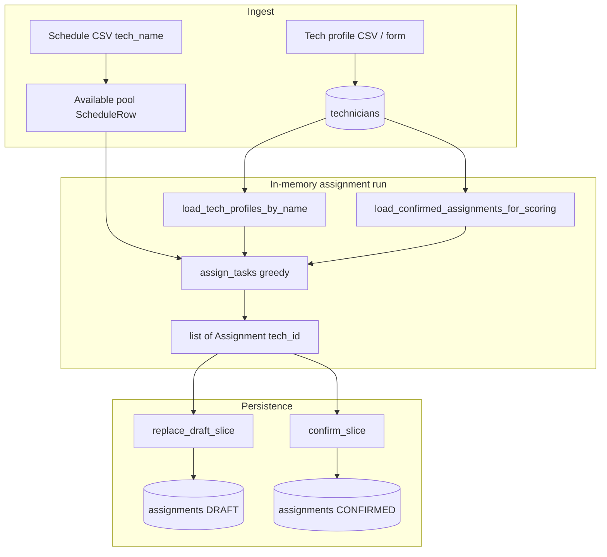

# Architecture overview — algorithm, persistence, and UI end-to-end

Walkthrough of how the whole app fits together, from the scoring algorithm down through the domain types, the database layer, and the Streamlit UI. Includes a system diagram and a file-level map of which code lives where so you can orient yourself before diving into any one piece.

---

## 1. What this doc covers

This file is the **integration** view. It assumes you have already met the scorer and the schema in their own docs; here we show how the pieces fit and which file owns what. If you’re new to the project, read the root [`README.md`](../README.md) and [`assignment_algorithm.md`](assignment_algorithm.md) first.

Core invariants enforced across layers:

- **One identifier for “who”:** domain `Assignment.technician_id` and DB `assignments.technician_id` are both **`tech_id`** (FK → `technicians.tech_id`). Schedule CSVs still carry **`tech_name`**; the app resolves name → `Tech` → `tech_id` before scoring or persisting.
- **Scoring uses published history only:** `confirmed_assignments` comes from DB rows with `status = confirmed`; drafts never inflate fairness or same-day terms.
- **Slice-scoped writes:** everything happens inside one `(work_date, time_slot)` — see [`persistence_database.md`](persistence_database.md) §0.
- **Deterministic row order:** `slot_index` (0..n−1) assigned from a stable sort on `(task_name, technician_id)` at write time.
- **Safe confirms:** unknown `tech_id`s (e.g. unmapped schedule names) are blocked at draft and confirm with an error listing missing ids.
- **Resilient UI:** if a draft for the selected slice exists, it reloads into session state on open/refresh.

---

## 2. System diagram

---

## 3. Domain and normalization

| Concept | Rule | Code |
|--------|------|------|
| **`tech_id`** | Trim only; **no** `.title()` (stable for FKs) | `normalize_tech_id` in `domain/validators/primitives.py` |
| **`tech_name`** | Non-empty, then title case for display / dedup | `Tech.__post_init__` |
| **`Assignment.technician_id`** | Means **`tech_id`** | `domain/entities/assignment.py` |
| **`Assignment.task_name`** | Normalized task label; currently stored in ORM `task_id` column for compatibility | `assignment_from_record` / writes |

Greedy output uses **`TechScoringProfile.tech_id`**; compatibility history matching uses **`_tech_matches_assignment`** comparing ids, not names (`core/assignment/compatibility_scoring.py`).

---

## 4. Database layer responsibilities

| Responsibility | Location |
|----------------|----------|
| Engine / URL (`.env`, `postgresql+psycopg`, bare `postgresql://` → psycopg3) | `db/session.py` |
| ORM models | `db/models/assignment_record.py`, `db/models/technician.py`, `db/models/task_catalog.py`, `db/models/assignment_override.py` |
| **Draft replace** (delete DRAFT slice → insert drafts) | `assignment_repository.replace_draft_slice` |
| **Confirm** (delete DRAFT + CONFIRMED slice → insert confirmed) | `assignment_repository.confirm_slice` |
| **Override draft/audit** | `override_repository.py` (`replace_draft_*`, `load_draft_overrides_for_slice`, `confirm_draft_overrides_for_slice`) |
| **Confirmed count** (overwrite warning) | `assignment_repository.count_confirmed_for_slice` |
| **Load draft slice** as domain assignments | `assignment_repository.load_draft_assignments_for_slice` |
| **FK coverage** (missing `tech_id`s) | `assignment_repository.technician_ids_missing_from_db` |
| **Tech profiles** keyed by normalized name | `scheduling_repository.load_tech_profiles_by_name` |
| **Confirmed history** for scoring window | `scheduling_repository.load_confirmed_assignments_for_scoring` |
| ORM ↔ domain | `db/adapters.py` |

Public re-exports live in `db/__init__.py`. Migrations run via `uv run alembic upgrade head`.

---

## 5. Streamlit UI layout

`app.py` only calls `configure_page()` and `render_app()`. Layout lives under `src/auto_assign/ui/`.

| Module | Purpose |
|--------|---------|
| `ui/page.py` | Page config, title, intro copy |
| `ui/db_state.py` | `database_url_configured()`, `tech_id_to_display_name()` |
| `ui/technicians_panel.py` | Technician CSV import + single-tech form |
| `ui/schedule/` (`workflow.py`, `outcome_banner.py`, …) | Schedule upload, date/slot, task counts, **manual overrides**, scoring options, generate, DB draft sync, draft table, FK validation, confirm + overwrite warning |
| `ui/__init__.py` | Composes `render_app()` |

For the user-facing step order (import profiles → schedule → generate → confirm), see [`operator_runbook.md`](operator_runbook.md) §5.

---

## 6. Testing

- **Greedy / scoring:** `tests/test_greedy_assignment.py` (including `tech_id` on assignments and history).
- **Adapters / scheduling loaders:** `tests/test_db_adapters.py`, `tests/test_scheduling_repository.py`.
- **Slice operations, draft load, FK helper:** `tests/test_assignment_repository.py`.
- **DB URL normalization (psycopg3):** `tests/test_db_session.py`.

---

## 7. Known limitations and follow-ups

- **Assignment task FK:** `assignments.task_id` still stores task label text for compatibility. A future migration can align this to strict catalog FK semantics.
- **Optional schedule `tech_id` column:** Recommended in design discussions but not in the CSV parser yet; names remain the schedule’s primary handle.
- **Concurrency:** Last-write-wins on confirm; no optimistic locking.
- **Streamlit packaging:** Requires the `auto_assign` package importable (e.g. `uv sync` / editable install and `uv run streamlit run app.py` from repo root).
