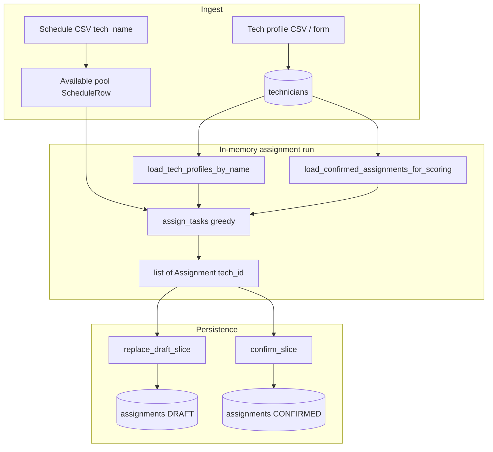

# Assignment, scoring, and persistence — implementation summary

This document summarizes what was built to connect **greedy compatibility scoring**, **domain assignments**, and **Postgres persistence** (draft + confirmed slices), and how the **Streamlit UI** is organized. It complements [`assignment_algorithm.md`](assignment_algorithm.md) (behavior) and [`persistence_database.md`](persistence_database.md) (schema + operator runbook).

---

## 1. Goals

- **Single identifier for “who” on an assignment:** Domain `Assignment.technician_id` and `assignments.technician_id` are **`tech_id`** (FK → `technicians.tech_id`), not display names. Schedule CSVs still use **`tech_name`**; the app resolves name → `Tech` → `tech_id` for scoring and storage.
- **Scoring uses published history only:** `confirmed_assignments` passed into greedy scoring come from DB rows with **`status = confirmed`** only; drafts do not affect fairness or same-day terms.
- **Slice-based persistence:** For each `(work_date, time_slot)`, **draft** rows are replaced on generate; **confirm** atomically removes **draft + confirmed** for that slice and inserts **confirmed** rows (last-write-wins, no separate audit table).
- **Deterministic ordering:** `slot_index` (0..n−1) on each row, assigned from a stable sort on `(task_name, technician_id)` when writing a slice.
- **Safe confirms:** Unknown `tech_id`s (e.g. unmapped schedule names using a synthetic id) are **blocked** from persisting or confirming with a clear error listing missing ids.
- **Resilient UI:** If the database holds a draft for the selected date/slot, the UI **reloads** that draft into session state so refresh or a new browser session still shows the same draft.

---

## 2. Architecture (high level)



---

## 3. Domain and normalization

| Concept | Rule | Code |
|--------|------|------|
| **`tech_id`** | Trim only; **no** `.title()` (stable for FKs) | `normalize_tech_id` in `domain/validators/primitives.py` |
| **`tech_name`** | Non-empty, then title case for display / dedup | `Tech.__post_init__` |
| **`Assignment.technician_id`** | Means **`tech_id`** | `domain/entities/assignment.py` |
| **`Assignment.task_name`** | Normalized task label; ORM column is `task_id` until a real tasks catalog exists | `assignment_from_record` / writes |

Greedy output uses **`TechScoringProfile.tech_id`**; compatibility history matching uses **`_tech_matches_assignment`** comparing ids, not names (`core/assignment/compatibility_scoring.py`).

---

## 4. Database layer

| Responsibility | Location |
|----------------|----------|
| Engine / URL (`.env`, `postgresql+psycopg`, bare `postgresql://` → psycopg3) | `db/session.py` |
| ORM models | `db/models/assignment_record.py`, `db/models/technician.py` |
| **Draft replace** (delete DRAFT slice → insert drafts) | `assignment_repository.replace_draft_slice` |
| **Confirm** (delete DRAFT + CONFIRMED slice → insert confirmed) | `assignment_repository.confirm_slice` |
| **Confirmed count** (overwrite warning) | `assignment_repository.count_confirmed_for_slice` |
| **Load draft slice** as domain assignments | `assignment_repository.load_draft_assignments_for_slice` |
| **FK coverage** (missing `tech_id`s) | `assignment_repository.technician_ids_missing_from_db` |
| **Tech profiles** keyed by normalized name | `scheduling_repository.load_tech_profiles_by_name` |
| **Confirmed history** for scoring window | `scheduling_repository.load_confirmed_assignments_for_scoring` |
| ORM ↔ domain | `db/adapters.py` |

Public re-exports live in `db/__init__.py`.

**Migrations:** Initial schema plus `slot_index` NOT NULL (backfill `0` then alter). Run `uv run alembic upgrade head`.

---

## 5. Streamlit UI

The entrypoint [`app.py`](../app.py) only calls `configure_page()` and `render_app()`. Layout lives under **`src/auto_assign/ui/`**:

| Module | Purpose |
|--------|---------|
| `ui/page.py` | Page config, title, intro copy |
| `ui/db_state.py` | `database_url_configured()`, `tech_id_to_display_name()` |
| `ui/technicians_panel.py` | Technician CSV import + single-tech form |
| `ui/schedule_assignments.py` | Schedule upload, date/slot, task counts, **scoring options**, generate, **DB draft sync**, draft table, **FK validation**, confirm + overwrite warning |
| `ui/__init__.py` | Composes `render_app()` |

### User flow (with database configured)

1. Import **technician profiles** so every schedule name you care about maps to a real **`tech_id`** row.
2. Upload **schedule**, pick **date** and **time slot**, set **task headcounts** (must sum to pool size).
3. Optional **Scoring options:** greedy random seed; **unlimited** confirmed history vs **fairness lookback (days)** for `load_confirmed_assignments_for_scoring` / `assign_tasks`.
4. **Generate assignments** — runs greedy scoring; if any assigned `tech_id` is missing from `technicians`, shows an error and **does not** write drafts. Otherwise **`replace_draft_slice`** and updates session state.
5. On each run, if the DB has **draft** rows for that slice, session state is **refreshed** from the DB (source of truth).
6. **Confirm schedule** — disabled if any `tech_id` is still missing; if confirmed rows already exist for the slice, shows a **warning** and requires a **checkbox** before confirm. **`confirm_slice`** runs in one transaction.

Without a database URL, generate still runs in memory and stores the result in session state only; confirm/draft persistence are not available.

---

## 6. Testing

- **Greedy / scoring:** `tests/test_greedy_assignment.py` (including `tech_id` on assignments and history).
- **Adapters / scheduling loaders:** `tests/test_db_adapters.py`, `tests/test_scheduling_repository.py`.
- **Slice operations, draft load, FK helper:** `tests/test_assignment_repository.py`.
- **DB URL normalization (psycopg3):** `tests/test_db_session.py`.

---

## 7. Known limitations and follow-ups

- **Tasks table:** Not implemented; `assignments.task_id` stores the normalized task string used as `Assignment.task_name`. A future `tasks` catalog + FK can be added without changing the greedy core.
- **Optional schedule `tech_id` column:** Recommended in design discussions but **not** in the CSV parser yet; names remain the schedule’s primary handle.
- **Concurrency:** Last-write-wins on confirm; no optimistic locking.
- **Streamlit:** Requires the `auto_assign` package importable (e.g. `uv sync` / editable install and `uv run streamlit run app.py` from repo root).

---

## 8. Quick reference commands

```bash
uv sync
uv run alembic upgrade head
uv run streamlit run app.py
```

See [`persistence_database.md`](persistence_database.md) §7 for the full operator checklist and URL notes.
